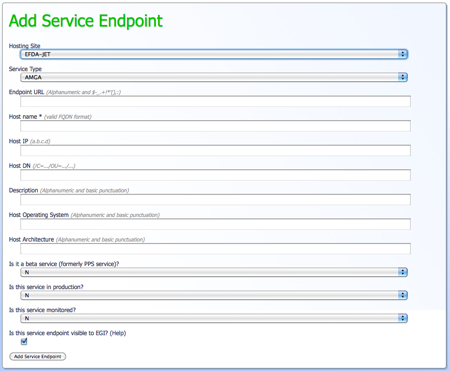

# <span class="twiki-macro SPACEOUT">Register perfSONAR Service in GOCDB</span>

## This section describes how to register the perfSONAR service in GOCDB.

In order to register you perfSONAR services in GOCDB, you should access the proper section of GOC for adding a Service
Endpoint

* <https://goc.egi.eu/portal/index.php?Page_Type=New_Service_Endpoint>

You might not be able to access the page if you are not properly registered in GOC, so a snapshot can be found below. In
filling the information please follow those simple guidelines:

* There are two service types for perfSONAR: net.perfSONAR.Bandwidth and net.perfSONAR.Latency. This is because we suggest t install two perfSONAR boxes at the site (one for latency tests and one for bandwidth tests) and therefore two distinct service endpoints should be published with two distinct service types. If the site can not afford sufficient hardware for the proposed setup, it can install a unique perfSONAR box, but still should publish both services types (with the same host in the "host name" field of the form).

* For each form (i.e. for each service type) fill at least the important informations:

```text

* Hosting Site (drop-down menu, mandatory)

* Service Type (drop-down menu, mandatory)

* Host Name (free text, mandatory)

* Host IP (free text, optional)

* Description: (free text, optional) This field has a default value of your site name. It is used to "Label" your host in our MaDDash GUI. If you want to use this field please use something as short as possible uniquely identifying this instance.

* Check "N" when asked "Is it a beta service"

* Check "Y" when asked "Is this service in production"

* Check "Y" when asked "Is this service monitored"

```

<!-- -->

* GOCDB screen shot for creating a Service Endpoint: <br /> 

-- Main.ShawnMcKee - 21 Oct 2014
